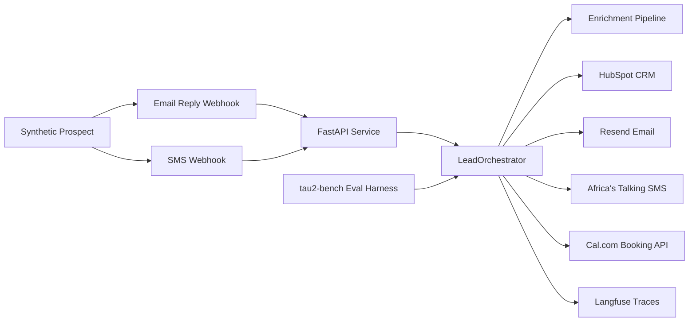

# Conversion Engine — **Outbound is sink-routed by default** (enable explicitly before live use)

FastAPI backend scaffold for the Tenacious sales-automation conversion engine challenge.

## What This Repo Covers

- inbound email and SMS webhook entrypoints (Resend + Africa's Talking)
- minimal SMS compliance controls for `STOP`, `HELP`, `UNSUBSCRIBE`, and `START`
- integrations for HubSpot CRM, Cal.com booking, and Langfuse tracing
- enrichment pipeline for Crunchbase firmographics, layoffs.fyi, job-post velocity, and AI maturity scoring (0–3)
- `tau2-bench` evaluation harness (dev split only; held-out partition sealed)

## Architecture



```text
conversion-engine/
├── agent/
│   ├── api/routes/         # FastAPI endpoints
│   ├── core/               # Settings and app config
│   ├── enrichment/         # Signal-enrichment pipeline stubs
│   ├── integrations/       # External service clients
│   ├── models/             # Webhook payload models
│   ├── storage/            # Local state scaffolding
│   ├── workflows/          # Orchestration layer
│   └── requirements.txt    # Runtime deps (pip-installable)
├── eval/                   # tau2-bench wrapper scripts
├── probes/                 # Adversarial probe notes
├── tests/                  # FastAPI and webhook tests
└── render.yaml             # Render deployment config
```

## Project Boundaries

- Keep `tau2-bench` in a separate sibling folder. This repo wraps it; it does not vendor it.
- Keep Cal.com separate as booking infrastructure. Point this app at its base URL through env vars.
- Do not commit live secrets. Use `.env` locally and configure real secrets in Render or GitHub.

## Local Setup

1. Create a virtualenv and install dependencies with `uv sync --group dev`.
2. Copy `.env.example` to `.env`.
3. Fill in your API keys and local paths.
4. Install git hooks (required once per clone):
   ```bash
   uv run pre-commit install && uv run pre-commit install --hook-type commit-msg
   ```
5. Start the API with `uv run uvicorn agent.main:app --reload`.

## Development Workflow

### Linting & formatting

Runs automatically on `git commit`. To run manually:

```bash
uv run ruff check --fix .
uv run ruff format .
```

### Commit message format

Commits must follow [Conventional Commits](https://www.conventionalcommits.org/):

```
type(scope): short description
```

Valid types: `feat`, `fix`, `chore`, `docs`, `test`, `refactor`, `ci`, `perf`, `build`, `style`, `revert`

```bash
# Good
git commit -m "feat(enrichment): add crunchbase funding signal"
git commit -m "fix(integrations): handle hubspot 429 retries"
git commit -m "chore: bump ruff to 0.15"

# Rejected — wrong format
git commit -m "fix auth bug"

# Rejected — bundles two changes
git commit -m "fix: update auth and add new endpoint"
```

### One module per commit

Commits that touch files from more than one `agent/` subdirectory are rejected. Keep each commit scoped to a single module (e.g. `agent/integrations` or `agent/enrichment`). Files in `tests/`, `eval/`, `scripts/`, and root config are neutral and may be included alongside any module.

To unstage a file: `git restore --staged <file>`

To bypass all hooks when genuinely needed: `git commit --no-verify`

## Environment

Key env vars in `.env.example`:

- `OPENROUTER_API_KEY`
- `HUBSPOT_API_KEY`
- `CALCOM_API_KEY`
- `CALCOM_BASE_URL`
- `LANGFUSE_PUBLIC_KEY`
- `LANGFUSE_SECRET_KEY`
- `RESEND_API_KEY`
- `AFRICASTALKING_API_KEY`

If Cal.com is tunneled through ngrok or Cloudflare Tunnel, keep `CALCOM_BASE_URL` aligned with the public URL configured in the Cal.com project.

## Testing

Run:

```bash
uv sync --group dev
uv run pytest
```

## Evaluation

`eval/run_baseline.py` assumes this folder layout:

```text
backend/
├── conversion-engine/
└── tau2-bench/
```

Baseline run (dev slice only — 30 tasks from the `train` split, 5 trials):

```bash
uv run python eval/run_baseline.py \
  --domain retail \
  --agent-llm openrouter/qwen/qwen3-next-80b-a3b-instruct \
  --user-llm openrouter/qwen/qwen3-next-80b-a3b-instruct \
  --trials 5 --num-tasks 30 --task-split-name train
```

Results are appended to `eval/score_log.json` (mean pass@1 + 95% CI) and `eval/trace_log.jsonl` (per-trial references to raw simulation dirs in `tau2-bench/data/simulations/`).

**Do not run with `--task-split-name test`** — that split is the sealed held-out partition and must not be touched until final evaluation.

## Deployment

`render.yaml` contains a starter Render service definition for the FastAPI app.

## Status

Interim submission (Act I + Act II). Core integrations and enrichment stubs are in place. The dev-tier τ²-Bench baseline has been run and artifacts are in `eval/`. Remaining work for final submission: adversarial probe library (Act III), mechanism design (Act IV), and two-page decision memo (Act V).

See `baseline.md` for the eval summary and `eval/score_log.json` for the full statistical breakdown.
