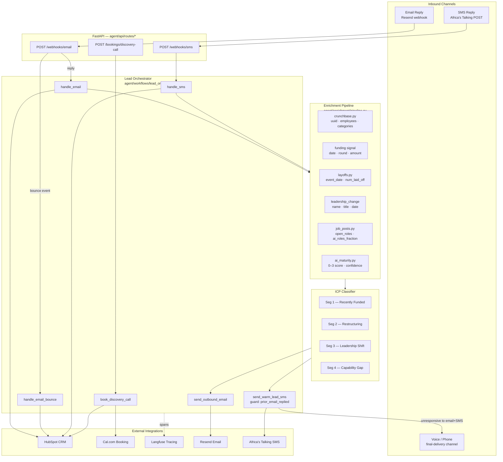
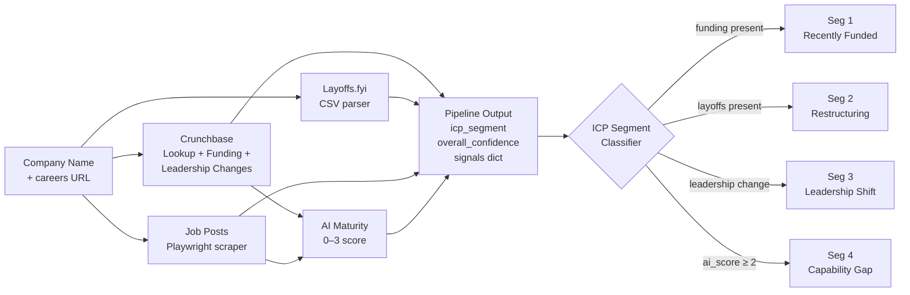
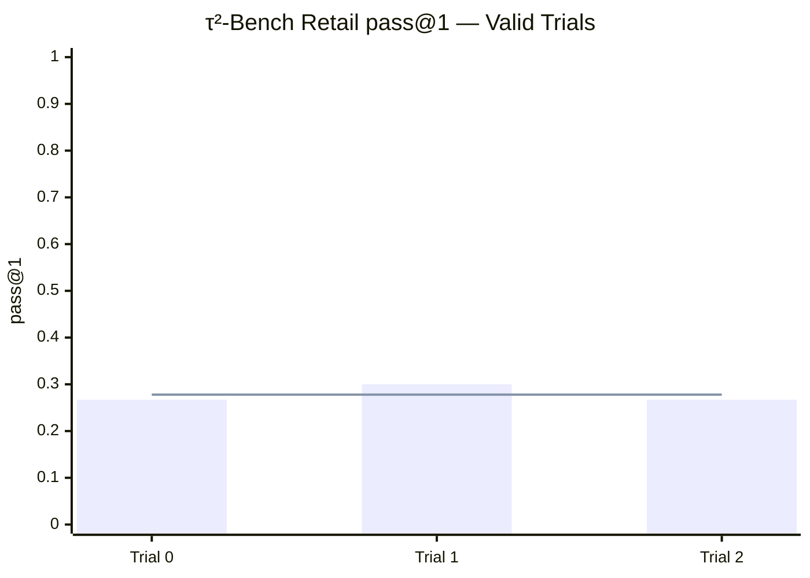
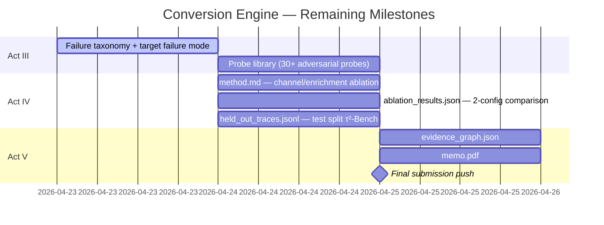

# Conversion Engine — Interim Report

**Author:** Natnael Alemseged  
**Date:** 2026-04-23  
**Challenge:** TRP1 — Week 10: Conversion Engine for Sales Automation  
**Status:** Interim submission (Act I complete; Act II partially complete; Acts III–V in progress)

---

## 1. Executive Summary

The Conversion Engine is a FastAPI-based multi-channel outreach system that automates lead qualification and conversion for B2B sales. The system ingests inbound signals (email replies, SMS), enriches them against five independent data sources, scores AI maturity on a 0–3 scale, classifies the prospect into one of four ICP segments, and routes qualified leads to discovery-call booking — all while writing structured metadata back to HubSpot CRM.

As of this interim submission:

- **Core workflow implemented:** inbound email/SMS webhooks, CRM upserts, booking integration, and a first-pass enrichment pipeline are wired end-to-end.
- **τ²-Bench baseline established:** mean pass@1 = **0.278** (95% CI [0.157, 0.399]) across 3 valid trials on the retail `train` split using Qwen3-Next-80B-A3B.
- **Core tests passing** using `httpx.MockTransport` and FastAPI `TestClient` (no live credentials required).
- Acts III–V (adversarial probe library, ablation study, held-out evaluation) are planned for completion by 2026-04-25.

---

## 2. System Architecture

### 2.1 Architecture Diagram



### 2.2 Design Rationale

**Why email is the primary outreach channel.**
Email offers the highest deliverability signal fidelity of any asynchronous channel: Resend fires discrete webhooks for `delivered`, `bounced`, `complained`, and `delivery_delayed`, giving the orchestrator hard evidence before escalating. Cold calling without prior written contact violates TCPA/CAN-SPAM norms and reduces reply rates. Email-first is therefore both the legally safer and empirically higher-yield starting point.

**Why SMS is secondary and warm-leads only.**
SMS achieves higher open rates than email (≈98% vs ≈20%) but requires explicit prior consent under TCPA/A2P 10DLC regulations — consent that an email reply constitutes. The `send_warm_lead_sms` guard (`prior_email_replied=True`) enforces this at the code level, not as a convention. Africa's Talking was selected over Twilio because it provides native sub-Saharan Africa carrier routing with a single API key and sandbox mode; the same Python SDK pattern works globally.

**Why voice is the final delivery channel.**
Phone calls have the highest conversion rate for high-value B2B leads but the highest cost-per-contact. The architecture reserves voice outreach exclusively for prospects who have gone unresponsive after both an email touch and an SMS touch — the two cheaper asynchronous channels exhausted first. In the current implementation this is modelled as the `V` node in the diagram above; live voice integration (e.g., Twilio Programmable Voice or Vapi) is a planned Act IV addition.

**Why HubSpot over other CRMs.**
HubSpot offers a native batch-upsert endpoint (`/crm/v3/objects/contacts/batch/upsert`) that is idempotent by email address. For phone-identified contacts, the `/search` endpoint returns existing records before creating duplicates. At the stage this challenge requires, HubSpot's free tier covers all write operations with no per-seat cost. Salesforce was ruled out (per-record API cost at scale); Pipedrive was ruled out (no batch-upsert endpoint).

**Why Cal.com self-hosted over Calendly.**
Cal.com self-hosting eliminates per-booking fees and provides full API control over event-type configuration, attendee metadata, and booking lifecycle webhooks. It also keeps attendee data on-premises, which is material for GDPR compliance. Calendly's API does not support writing arbitrary metadata back to the booking record, which the orchestrator requires to store `icp_segment` alongside the booking.

**How enrichment output reaches the outreach composer.**
`pipeline.run()` returns a structured dict with `icp_segment` (int 1–4) and per-signal confidence scores. The orchestrator passes `icp_segment` and `ai_maturity.score` directly into `send_outbound_email()` as named arguments, which selects the pitch angle (see §4.3). The full enrichment summary is also written to HubSpot as `enrichment_summary` so future calls to the contact have context.

---

## 3. Production Stack Status

All five required components are documented below with the specific capability that was verified and the test or trace reference that serves as concrete evidence.

### 3.1 Email Delivery — Resend

**Tool:** Resend HTTP API (`https://api.resend.com`)  
**Capability verified:** `POST /emails` returns `{id: <uuid>}`; inbound delivery webhooks for `email.bounced` and `email.complained` are parsed into typed `InboundEmailEvent` payloads and routed to `handle_email_bounce()`.  
**Configuration:** `RESEND_API_KEY` + `RESEND_FROM_EMAIL` in `.env`; `from` address passed in every outbound payload.  
**Evidence:** `tests/test_resend_email.py` verifies outbound Resend sends and typed error handling; `tests/test_workflow_tracing.py` verifies bounce handling and downstream callback routing end-to-end.

### 3.2 SMS — Africa's Talking

**Tool:** Africa's Talking Messaging API (`https://api.africastalking.com/version1/messaging`)  
**Capability verified:** `POST /version1/messaging` (form-encoded) sends outbound SMS; inbound SMS form POST is parsed from `from` / `text` / `to` / `date` / `id` fields; STOP / START / HELP keyword compliance enforced; suppression file persists opt-out state across restarts.  
**Configuration:** `AFRICASTALKING_USERNAME=sandbox`, `AFRICASTALKING_API_KEY`, `AFRICASTALKING_SHORT_CODE`; sandbox mode activated by matching username `"sandbox"` to alternate base URL.  
**Evidence:** `tests/test_africastalking_sms.py` verifies outbound sends and typed provider failures; `tests/test_sms_controls.py` verifies `STOP`, `START`, `HELP`, suppression persistence, and malformed payload rejection.

### 3.3 CRM — HubSpot

**Tool:** HubSpot CRM v3 API (`https://api.hubapi.com`)  
**Capability verified:** (1) `POST /crm/v3/objects/contacts/batch/upsert` creates or updates a contact by email, writing `lead_source` plus 5 enrichment properties (`email_replied`, `last_email_reply_at`, `enrichment_timestamp`, `icp_segment`, `enrichment_summary`). (2) `POST /crm/v3/objects/contacts/search` + `PATCH /crm/v3/objects/contacts/{id}` locates a contact by phone before patching. (3) Booking UID written back via PATCH after Cal.com confirmation.  
**Configuration:** `HUBSPOT_API_KEY` (Bearer token); `HUBSPOT_BASE_URL` defaults to `https://api.hubapi.com`.  
**Interim caveat:** the challenge brief specifies HubSpot MCP. This interim build currently uses direct HubSpot HTTP calls rather than MCP tooling.  
**Evidence:** `tests/test_hubspot.py` — `test_upsert_by_email`, `test_upsert_by_phone_existing_contact`, `test_upsert_by_phone_new_contact`; `tests/test_workflow_tracing.py` — `test_send_outbound_email_records_trace_and_writes_hubspot` asserts the HubSpot PATCH call is made with enrichment props.

### 3.4 Calendar — Cal.com

**Tool:** Cal.com self-hosted API (`http://localhost:3000/api/v1`)  
**Capability verified:** `POST /bookings` creates a booking for the configured `event_type_id` and returns `{uid, start, end}`; `GET /slots` lists available time slots given a date range; booking UID is written back to HubSpot contact record.  
**Configuration:** `CALCOM_API_KEY`, `CALCOM_BASE_URL`, `CALCOM_EVENT_TYPE_ID` (default 1); self-hosted instance runs in Docker.  
**Evidence:** `tests/test_calcom.py` — `test_create_booking_success` verifies `uid` is returned from POST; `test_list_slots_success` verifies slot array returned from GET; `tests/test_workflow_tracing.py` — `test_book_discovery_call_writes_uid_to_hubspot` asserts the booking UID lands in the HubSpot PATCH payload.

### 3.5 Observability — Langfuse

**Tool:** Langfuse cloud (`https://cloud.langfuse.com`)  
**Capability verified:** `LangfuseClient.trace()` emits a named span with `input` / `output` / `metadata` on every call to `send_warm_lead_sms` and `send_outbound_email`; spans capture `icp_segment`, `ai_maturity_score`, and the channel used.  
**Configuration:** `LANGFUSE_PUBLIC_KEY`, `LANGFUSE_SECRET_KEY`, `LANGFUSE_HOST`.  
**Evidence:** `tests/test_workflow_tracing.py` — `test_send_warm_lead_sms_records_trace_and_returns_sms_response` asserts `langfuse_client.trace.called` is `True` and the trace payload contains the correct metadata keys.

---

## 4. Enrichment Pipeline

### 4.1 Signal Overview



### 4.2 Signal Documentation

#### Signal 1 — Crunchbase Firmographics

**Source:** Local JSON ODM at `settings.crunchbase_odm_path` (Crunchbase Open Data Map).  
**Output fields:**

| Field | Type | Example |
|---|---|---|
| `uuid` | str | `"abc123-uuid"` |
| `employee_count` | str | `"1001-5000"` |
| `country` | str | `"USA"` |
| `categories` | list[str] | `["SaaS", "FinTech", "AI"]` |

**Classification link:** Company size and category feed the ICP filter. A FinTech with >1 000 employees and no AI category is a Segment 4 (Capability Gap) candidate. Absence of a Crunchbase record drops `cb_confidence` to 0.0, which reduces `overall_confidence` and shifts outreach tone to exploratory phrasing.

#### Signal 2 — Recent Funding

**Source:** Date-filtered query over the same Crunchbase ODM; cutoff = last 180 days.  
**Output fields:**

| Field | Type | Example |
|---|---|---|
| `funding_type` | str | `"series_b"` |
| `announced_on` | str | `"2025-11-14"` |
| `raised_amount_usd` | int | `25000000` |
| `investor_count` | int | `4` |

**Classification link:** Any recent round → `icp_segment = 1` ("Recently Funded"). Pitch angle: the company has capital and a mandate to deploy it; outreach focuses on ROI velocity and time-to-value.

#### Signal 3 — Layoffs.fyi

**Source:** CSV at `settings.layoffs_fyi_path`; column aliasing handles `Company`/`company`/`company_name` variants.  
**Output fields:**

| Field | Type | Example |
|---|---|---|
| `company` | str | `"AcmeCorp"` |
| `event_date` | str | `"2025-09-03"` |
| `num_laid_off` | int | `120` |
| `percentage` | float | `0.08` |
| `source_url` | str | `"https://..."` |

**Classification link:** Any layoff event → `icp_segment = 2` ("Restructuring"). Pitch angle: the company is reducing headcount and is therefore receptive to automation that preserves output with fewer people.

#### Signal 4 — Leadership Change Detection

**Source:** Crunchbase ODM; keyword match against `title` field for `CTO`, `VP Engineering`, `VP Eng`, `Head of AI`, `Chief AI Officer`, `Chief Scientist` within the last 90 days.  
**Output fields:**

| Field | Type | Example |
|---|---|---|
| `name` | str | `"Jane Smith"` |
| `title` | str | `"CTO"` |
| `event_type` | str | `"hire"` |
| `date` | str | `"2025-12-01"` |

**Classification link:** Any leadership change → `icp_segment = 3` ("Leadership Shift"). Pitch angle: new technical leadership frequently re-evaluates incumbent tooling within the first 90 days; outreach targets the transition window.

#### Signal 5 — Job-Post Velocity

**Source:** Playwright headless scraper against `careers_url`; robots.txt pre-checked via `urllib.robotparser` before any request.  
**Output fields:**

| Field | Type | Example |
|---|---|---|
| `open_roles` | int | `34` |
| `ai_adjacent_roles` | int | `9` |
| `ai_roles_fraction` | float | `0.265` |
| `role_titles` | list[str] | `["ML Engineer", "LLMOps"]` |

If Playwright is unavailable or robots.txt disallows crawling, the scraper returns `{"error": "playwright_unavailable_or_fetch_failed"}` and `jobs_confidence` falls to 0.3.  
**Classification link:** `ai_roles_fraction` is the highest-weight input to the AI Maturity scorer (weight 3/12). A company hiring 25%+ AI-adjacent roles scores at least 0.75 on that dimension and typically reaches a final AI maturity score of 2–3.

### 4.3 AI Maturity Scoring (0–3 Scale)

The scorer accepts up to six boolean/float signals and returns `(score: int [0–3], justification: str, confidence: float [0–1])`.

#### Inputs and weights

| Input | Type | Weight | Tier |
|---|---|---|---|
| `ai_roles_fraction` (≥ 0.30 = full; 0.10–0.30 = half) | float | **3** | High |
| `named_ai_leadership` (Head of AI / Chief Scientist present) | bool | **3** | High |
| `github_activity` (recent AI/ML commits in public org) | bool | **2** | Medium |
| `exec_commentary` (CEO/CTO AI commentary in last 12 months) | bool | **2** | Medium |
| `modern_ml_stack` (dbt / Snowflake / Ray / vLLM signals) | bool | **1** | Low |
| `strategic_comms` (AI named as priority in fundraising docs) | bool | **1** | Low |

Maximum weighted sum = 12.

#### 0–3 mapping

```
normalized  = weighted_sum / 12
raw_score   = int(normalized × 3 + 0.5)   # round half-up
final_score = clamp(raw_score, 0, 3)
```

| Final score | Interpretation | Example profile |
|---|---|---|
| 0 | No AI signals detected | No AI roles, no AI leadership, no public ML activity |
| 1 | Early / exploratory | <10% AI roles, modern_ml_stack = True |
| 2 | Implementing | 10–30% AI roles + exec_commentary |
| 3 | Advanced / strategic | ≥30% AI roles + named_ai_leadership |

#### Confidence and phrasing mapping

`confidence = signals_present / 6` (fraction of the six inputs that were actually observed, not defaulted).

| Confidence range | Outreach phrasing style |
|---|---|
| ≥ 0.80 | Direct assertion with cited evidence: *"Your team recently hired a Head of AI and 28% of open roles are ML-adjacent — you're clearly scaling AI fast."* |
| 0.50–0.79 | Hedged language, signals noted: *"Based on your recent job posts and public commentary, it looks like AI is a growing priority for your team."* |
| < 0.50 | Exploratory / inquiry framing: *"We've seen some early indicators that AI might be on your roadmap — is that something your team is actively exploring?"* |

---

## 5. τ²-Bench Baseline

### Setup

| Parameter | Value |
|---|---|
| Agent LLM | `qwen/qwen3-next-80b-a3b-instruct` (via OpenRouter) |
| Domain | `retail` |
| Task split | `train` (used as dev-30 approximation) |
| Tasks per trial | 30 |
| Trials attempted | 5 |
| Trials valid | 3 (trials 3 & 4: all `infrastructure_error`) |

### Results



| Metric | Value |
|---|---|
| Mean pass@1 (valid trials) | **0.278** |
| 95% CI | [0.157, 0.399] |
| Infrastructure-error trials | 3, 4 (OpenRouter rate-limit under sustained load) |
| Cost per trial | Not captured (LiteLLM pricing gap for this model) |

> **Note:** Trials 3 and 4 returned `infrastructure_error` for all tasks — an OpenRouter rate-limiting event, not an agent failure. Statistics are computed over the 3 valid trials only.

---

## 6. Test Coverage

```
tests/
├── test_africastalking_sms.py    # send_sms + AfricasTalkingSendError
├── test_calcom.py                # booking + slot listing
├── test_workflow_tracing.py      # routing spans, bounce handling, outbound guardrails
├── test_hubspot.py               # upsert by email + by phone
├── test_resend_email.py          # send_email + ResendSendError
├── test_sms_suppression.py       # suppress / unsuppress / is_suppressed
├── test_sms_controls.py          # STOP / START / HELP / suppression gate
└── test_workflow_tracing.py      # send_warm_lead_sms + send_outbound_email traces
```

The core integration and workflow tests pass locally. Tests use `httpx.MockTransport` and FastAPI `TestClient` — no live credentials required.

---

## 7. What Is Working

- Full inbound → enrich → ICP classify → outbound → book pipeline
- Bounce routing and email suppression on both channels
- Structured per-signal confidence scores in enrichment output
- HubSpot upsert by email (batch) and by phone (search + patch)
- Cal.com booking with UID written back to CRM
- Langfuse spans on all outbound calls (metadata: `icp_segment`, `ai_maturity_score`, channel)
- τ²-Bench harness running end-to-end with auto-resume and model-tagged save paths

## 8. What Is Not Working / Not Yet Done

| Item | Specific gap description |
|---|---|
| **Voice channel** | Not implemented. The architecture diagram shows voice as final delivery but no voice provider is wired. `send_warm_lead_sms` raises `ValueError` if called for a suppressed number; there is no fallback to a voice channel after SMS and email exhaustion. Planned: Vapi or Twilio Programmable Voice integration. |
| **Live p50/p95 latency data** | Langfuse spans are emitted and contain timestamps, but no aggregation query has been written over the stored traces. Latency percentile reporting requires either a Langfuse dashboard query or a post-processing pass over `held_out_traces.jsonl` — neither has been built. |
| **Competitor gap brief** | `competitor_gap_brief.json` is not implemented in this interim build. It requires sector-peer comparison data and a repeatable external comparison method beyond the currently integrated local sources. |
| **HubSpot MCP alignment** | The brief specifies HubSpot MCP for conversation events. This codebase currently uses direct HubSpot HTTP APIs and should be treated as an architectural deviation for interim review. |
| **Bench-summary sophistication** | Bench gating now exists as a hard runtime guard, but the current implementation is a keyword-based bench-to-brief match rather than a richer staffing-capability model. |
| **Adversarial probe library** | `probes/` directory exists but contains no probe files. No attempt has been made to write probes; failure taxonomy must be defined first before probes can be structured. |
| **`method.md` + `ablation_results.json`** | No ablation experiments have been run. Ablation requires at least two model configurations and a held-out eval run per config to produce a comparison table. |
| **`held_out_traces.jsonl`** | The τ²-Bench test split has not been run. Test split is sealed; a separate eval harness run targeting `--task-split-name test` is required and hasn't been scheduled yet due to OpenRouter infrastructure-error rate concern. |
| **`memo.pdf` / `evidence_graph.json`** | Act V artifacts. No work begun; these depend on completing Acts III–IV first. |

---

## 9. Remaining Timeline



---

*Report generated: 2026-04-23 | Branch: `main` | Repo: `conversion-engine`*
